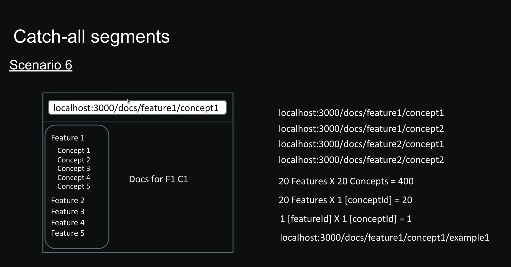
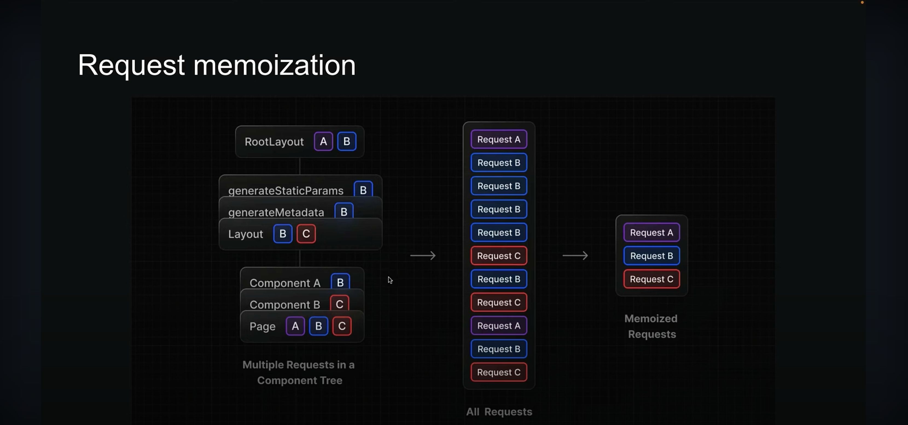

# Next.js Notes

`Next.js` is a React framework for building full-stack web applications. It's not feasible to create a fully-featured application ready for production using only React. React is a library for building user interfaces, and you need to make decisions about other features such as routing, data fetching, and more.

`Next.js` uses React for building user interfaces and provides additional features that enable you to build production-ready applications. These features include routing, optimized rendering, data fetching, bundling, compiling, and more. We don't need to install additional packages as Next.js provides everything we need. Conventions should be followed to implement these features.

## Usage

1.  **ROUTING** - For routing in React, we need to make use of third-party packages, but Next.js simplifies this by providing **file-based routing**. By creating files, routing is automatically generated and taken care of.
2.  **API ROUTES** - Build both client and server-side components and APIs within the same application for seamless integration between the backend and frontend.
3.  **RENDERING** - Supports both client and server-side rendering. Improved performance and SEO when implemented properly.
4.  **DATA FETCHING** - Streamline data fetching.
5.  **STYLING** - Flexible with styling approaches, supporting CSS modules.
6.  **OPTIMIZATION** - Out-of-the-box optimization for images, fonts, and scripts, enhancing application performance.
7.  **DEV AND PROD BUILD SYSTEM** - Focus on writing code instead of dealing with configurations.

## Server-Side Components and Client-Side Components

1.  By default, all components in Next.js are **Server-Side Components**.
2.  To define a client-side component (which is the traditional React component), we have to declare `"use client"` at the top of the file.
3.  Client-side components cannot function like server-side components and won't act and display in a route.
4.  Server-side components cannot make use of functions that client-side components provide, like using **hooks**.

## Routing

1.  Next.js uses **file-based routing**.
2.  Define a folder called `about` and within that, declare `page.tsx`. This convention needs to be followed.
3.  Navigate to `localhost:3000/about`. The component defined within `about/page.tsx` gets rendered.

### Conventions

1.  All routes must live inside the `app` folder within the `src` directory.
2.  Route files must be named either `page.jsx` or `page.tsx`.
3.  Each folder represents a segment of the URL path.
4.  Routes are directly tied to the folder name of the directory.

## Nested Routing

1.  Define a folder called `blog` and within that, declare `page.tsx`.
2.  Create two separate folders within the `blog` folder named `first` and `second` respectively.
3.  Create `page.tsx` within the `first` and `second` folders.
4.  Now navigate to `localhost:3000/blog`, `localhost:3000/blog/first`, and `localhost:3000/blog/second`.

## Dynamic Routing

1.  Define a folder called `products` and within that, declare `page.tsx`.
2.  Add the following content within:

    ```tsx
    <>
      <h1>Product Lists</h1>
      <h2>Product 1</h2>
      <h2>Product 2</h2>
      <h2>Product 3</h2>
    </>
    ```

3.  Create a new folder within `products` with the name wrapped as `[productId]` and within it define `page.tsx`.
4.  Add the following content:

    ```tsx
    import React from "react";

    const ProductDetails = ({ params }: { params: { productId: string } }) => {
      return (
        <>
          <h1>Details about product {params.productId}</h1>
        </>
      );
    };

    export default ProductDetails;
    ```

5.  Now navigate to `localhost:3000/products`, `localhost:3000/products/1`, and `localhost:3000/products/1000`.

## Nested Dynamic Route

1.  Check the implementation of the `products` -> `reviews` folder.
2.  Navigate to `localhost:3000/products/1/reviews/100` to see a nested dynamic route.

## Catch-All Segments



Please check the `docs` and `docs1` folders to completely understand it, as it is too verbose to describe here.

Use `[...slug]` or `[[...slug]]`.
`slug` is an array with `queryId` as params. Eg: `[1, 101]` for `/feature/1/concept/101`.
The essential difference between `[...slug]` and `[[...slug]]` is that `[[...slug]]` paves a way for the route `/docs1` to render and return the last statement. Navigate to `localhost:3000/docs` and `localhost:3000/docs1` to know the difference.

**Question:** But having a `page.tsx` in `docs` should behave the same, right?
If the UI is to be consistent or the same, then we can have `page.tsx` in the `docs` folder. When the page UI changes based on the URL, we keep it in the `[[...slug]]` folder.

## Private Routes

1.  `_foldername` indicates a private route which Next.js won't serve. (Check the `_lib` folder for this).
2.  So, `_` at the start of a folder name serves to create a private route, making it reserved.
3.  To have a folder that starts with an `_`, use `%5F` instead. (Check the `%5Flib` folder for this).

### Advantages of Private Routes

- Keep UI logic separate from routing logic.
- Have a consistent way to organize internal files in our project.
- Easier grouping.
- Avoid potential naming conflicts with future Next.js file naming conventions.

## Route Groups

1.  Wrapping a folder name with `()` informs Next.js to treat the route group as excluded from the route's URL path.
2.  The name will be omitted from the URL path.
3.  Route groups help us to organize our code better.
4.  Nesting is possible in route groups. Route groups can be nested within each other.

## Layouts

1.  A **page** is UI that is unique to a route.
2.  A **layout** is UI that is shared between multiple pages in the app.
3.  You can define a layout by default exporting a React component from a `layout.js` or `layout.tsx` file. This is the mandatory layout.
4.  The component should accept a `children` prop that will be populated with a child page during rendering.
5.  Check the `layout.tsx` file.

## Nested Layouts

1.  Layouts can be nested. It could be specific to a product details page. You can define it within the `[productId]` folder.
2.  Check `layout.tsx` in the `products/[productId]` folder.
3.  Navigate to `localhost:3000/products/100` and check it out.

## Route Group Layouts

1.  You can apply layouts only to specific components within a route group.
2.  Create a new folder within `(auth)` called `(with-layout)` and add `layout.tsx` with contents copied from another `layout.tsx` from the `products` folder.
3.  Add the `register` and `login` folders to this `with-layout` folder and navigate to `localhost:3000/register` and `localhost:3000/login` to see the layout being applied with contents.
4.  `localhost:3000/forgot-password` won't have the changes for the local layout as it falls outside the directory of `(with-layout)`.

## Multiple Root Layouts

Check video.

## Not Found Page

1.  A generic not-found page can be used by creating a file in the `app` folder. The file should be named `not-found.tsx` as per convention.
2.  The `notFound` component can be imported using:
    ```tsx
    import { notFound } from "next/navigation";
    ```
    and calling:
    ```tsx
    notFound();
    ```
3.  Each route can have a specific not-found page, so when a route doesn't match, the `not-found.tsx` within that route is rendered instead of the parent one in the `app` folder.
4.  The `NotFound` component does not accept any props.

**Question:** So what about if we need to show custom messages?

You can use `usePathname` from `next/navigation`:

```tsx
import { usePathname } from "next/navigation";
```

## File Colocation

Keeping UI or components files separate in a component folder and include using:
`import BarChart from '@/components/barChart';`
Or make use of Private routes.

## Routing Metadata

1.  The metadata API in Next.js is a powerful feature that lets us define metadata for each page.
2.  Metadata ensures our content looks great when it's shared or indexed by search engines.
3.  There are two ways to handle metadata in `layout.tsx` or `page.tsx`.

### Conventions

- Both `layout.tsx` and `page.tsx` can export metadata. Layout metadata applies to all its pages, while page metadata is specific to that page.
- Metadata follows a top-down order, starting from the root level.
- When metadata exists in multiple places along a route, they merge, with page metadata overriding layout metadata for matching properties.
- We cannot use a metadata object and a `generateMetadata` function within the same component. It's either one or the other.
- It will not work in `use client` components.

Title for routing metadata are of 2 types. One is string like "About me" or an object. Check the `blog` component and root layout.

## Link Component Navigation

1.  Up until now, we used to manipulate the URL in the browser to view content, but what about navigation when a link is clicked (actual usage in real-world apps)? Here comes the **Link component**.
2.  For client-side navigation, Next.js gives us the `<Link>` component.
3.  The `<Link>` component extends HTML's `<a>` (anchor) element, and it's the primary way to navigate between routes in Next.js.
4.  To use, import from `"next/link"`.
    ```tsx
    <Link href="/blog">Blog</Link>
    ```

## `params` and `searchParams`

For a given URL:

1.  `params` is a promise that resolves to an object containing the dynamic route parameters (e.g., `id`).
2.  `searchParams` is a promise that resolves to an object containing the query parameters (like filters and sorting).
3.  While `page.tsx` has access to both `params` and `searchParams`, `layout.tsx` has access to only `params`.

`async/await` support is available for only server components and not client components.
For accessing `params` and `searchParams` in client components, we will need to make use of the `use` hook in React.
Check the implementation in `articles/`.

## Programmatic Navigation

In a marketplace, after a user places an order, we might want to redirect them to the home page or another route. We can use `useRouter` or `redirect`.

```tsx
import { useRouter, redirect } from "next/navigation";

const router = useRouter();

/** Redirect to home page */
router.push("/");

/** Go back in history */
router.back();

/** Go forward in history */
router.forward();

/** To replace instead of adding entry to history stack */
router.replace("/");

/** We can also use redirect instead of useRouter. Check for example in products -> reviews */
redirect("/");
```

## Templates

1.  Templates are similar to layouts in that they also share the same UI across multiple components/pages in our app.
2.  Whenever a user navigates between routes sharing a template, you get a completely fresh start in terms of:
    - A new template component instance is mounted.
    - DOM elements are recreated.
    - State is cleared.
    - Effects are resynchronized.
3.  Like layouts, templates need to accept a `children` prop to render the nested route segments.
4.  Layouts and templates can be used together, in which case the children of the layout are rendered first, before the template and then the page.
5.  Layouts should be the go-to most of the time.

Rendering takes place in the following sequence:
`Layout` -> `Template` -> `Page contents`

For example, take an input element in `(auth)/layout.tsx`. The input element is shared between all three routes: `register`, `login`, and `forgot-password`. If we type something in the input box and then switch between the routes, the input value remains as it is (if `layout.tsx` is defined). With `template.tsx`, the input box will get cleared when a switch is made between the routes. (Try renaming `layout.tsx` to `template.tsx`, go to `/register`, type something, and switch to `/login`).

## Loading (`loading.tsx`)

1.  Loading provides users with immediate feedback when they navigate between routes, making the application feel responsive and letting users know they have performed an action.
2.  Next.js keeps shared layouts interactive while the new content loads. Users can make use of the menu/sidebar even when the main content isn't ready yet.

## Error Handling (`error.tsx`)

1.  This can be done by creating a new `error.tsx` file in a route.
2.  `ErrorBoundary` must be a client component.
3.  `error.tsx` automatically wraps route segments and their nested children in a React Error Boundary.
4.  You can create custom error UIs for specific segments using the file system hierarchy.
5.  `error.tsx` isolates errors to affected segments while keeping the rest of the application functional.
6.  It enables you to attempt to recover from an error without requiring a full page reload.

#### Handling Errors in a Nested Route

- Errors always bubble up to find the closest error boundary.
- An `error.tsx` file not only handles errors in its own folder but for all nested child segments below it too.
- By strategically placing `error.tsx` files at different levels in your route folders, you can control exactly how detailed your error handling gets.
- Where you put your `error.tsx` files makes a huge difference; it determines exactly which parts of your UI get affected when things go wrong.

E.g., Try moving the `error.tsx` file from the `reviewId` folder to the `products` folder (check the difference on the UI) and then placing it back in the `reviewId` folder (check the difference on the UI now).

#### Handling Errors in Layouts

- An `error.tsx` will handle errors for all of its nested segments (children).
- But there's an interesting catch with the `layout.tsx` component within the same segment.
- The error boundary won't catch the errors thrown in `layout.tsx` within the same segment because of how the hierarchy works.
- The layout sits above the error boundary in the component tree.
- The solution is to move `error.tsx` to the parent of `layout.tsx`.

### Handling Global Errors

- If an error boundary can't catch errors in the `layout.tsx` file from the same segment, what about the errors in the root layout? It doesn't have any parent segment. How do we handle those?
- Next.js provides a special file called `global-error.tsx` that goes in the root `app` directory.
- This is the last line of defense when something goes catastrophically wrong at the highest level of the app.
- You need to include `<html>` and `<body>` tags in `global-error.tsx`, as the component replaces the root layout.
- It works only in production mode (in dev, it will throw an error).

## Component Hierarchy

```
<Layout>
  <Template>
    <ErrorBoundary fallback={<Error />}>   // Error boundary for Run time errors, error.tsx
      <Suspense fallback={<Loading />}>     // Suspense from loading.tsx
        <ErrorBoundary fallback={<NotFound />}> // Error boundary for Missing resources, not-found.tsx
          <Page/>
        </ErrorBoundary>
      </Suspense>
    </ErrorBoundary>
  </Template>
</Layout>
```

## Parallel Routes

1.  Parallel routes is an advanced routing mechanism that lets us render multiple pages simultaneously within the same layout.
2.  Parallel routes in Next.js are defined using a feature called **slots**.
3.  Slots help organize content in a modular way.
4.  To create a slot, we use the `@folder` naming convention.
5.  Each defined slot automatically becomes a prop in its corresponding `layout.tsx` file.

**Note:** Slots are not route segments and don't affect your URL structure. Navigating to `localhost:3000/complex-dashboard/users` or `@users` will result in a `Page not found` error. The `children` prop in `layout.tsx` is an implicit slot that doesn't need its own folder. `complex-dashboard/page.tsx` is the same as `complex-dashboard/children/page.tsx`.

#### Use Cases of Parallel Routes

- Dashboards with multiple sections
- Split-view interfaces
- Multi-pane layouts
- Complex admin interfaces

#### Benefits

- **Modular organization:** Parallel routes are great for splitting a layout into manageable slots (especially when different teams are working on different parts).
- **Independent route handling:** Each slot in your layout (e.g., `users`, `revenue`, `notifications`) can handle its own loading and error states. This is useful when different sections of the page load at varying speeds or encounter unique errors.
- **Sub-navigation:** Each slot can function as a mini-application, with its own navigation and state management. Users can interact with each section separately without affecting other parts. For example, for notifications, users can view archived notifications instead of the default one by changing the URL to `/complex-dashboard/archived` (archived) or `/complex-dashboard` (default).

#### Unmatched Routes

1.  **Navigation from UI:** When navigating through the UI (clicking links), Next.js keeps showing whatever was in the unmatched slots before (for `children`, `users`, `revenue`).
2.  **Page reload:** Next.js looks for a `default.tsx` file in each unmatched slot. This file is critical as it serves as a fallback to render content when the framework cannot retrieve a slot's active state from the current URL. Without this file, you get a 404 (Page not found).
3.  Check the `default.tsx` file in each of `users`, `revenue`, and the root of `complex-dashboard` (for `children`). When on the `/complex-dashboard/archived` route, try refreshing the page; the content within `default.tsx` for each parallel route will be displayed.

#### Conditional Routes

1.  Imagine you want to show different content based on whether a user is logged in or not.
2.  You might want to display a dashboard for authenticated users but show a login page for those who aren't.
3.  Conditional routes allow us to achieve this while maintaining completely separate code on the same URL.
4.  Check the `login` slot implementation in `complex-dashboard`.

## Intercepting Routes

1.  Intercepting routes is an advanced routing mechanism that allows you to load a route from another part of your application within the current layout.
2.  It's particularly useful when you want to display new content while keeping the user in the same context.
3.  Consider a home page where a user clicks a login button. Instead of routing to `localhost:3000/login`, we can use a modal (with `localhost:3000/login` as the URL).
4.  Consider a photo gallery. When a user clicks on a photo, instead of showing a dedicated photos page at `localhost:3000/photos/id`, we can enlarge the photo within the same page as a modal (with `localhost:3000/photos/id` as the URL).
5.  Essentially, the URL is shared, and refreshing the page works as well.

### Conventions

- `(.)`: to match segments on the same level in the folder structure. It is similar to `./` (current working directory). Check the `folder2` (destination) example in `folder1` (source).
- `(..)`: to match segments that are one level above. Similar to `../`. Check the `folder3` (destination) example in `folder1` (source).
- `(..)(..)`: to match segments that are two levels above. Similar to `../../`. Check the `folder4` (destination) example called from `folder2` (source).
- `(...)`: to match segments from the root `app` directory. Check the `folder5` (destination) example within `inner-folder2` (source).

#### Intercepting Parallel Routes

Check the `photo-feed` folder for code or navigate to `localhost:3000/photo-feed`.

## Route Handlers

1.  We have learned how to route to pages.
2.  The App Router lets you create custom request handlers for your routes using a feature called Route Handlers.
3.  Unlike page routes, which give us HTML content, **Route Handlers** let us build RESTful endpoints with complete control over the response.
4.  Think of it as building a Node + Express app.
5.  There is no need to set up and configure a separate server.
6.  Route handlers are great when making external API requests as well.
7.  Route handlers run server-side, so sensitive info like private keys stays secure and never reaches the browser.
8.  Route handlers are the equivalent of API routes in the Pages Router.
9.  Next.js supports `GET`, `POST`, `PUT`, `PATCH`, `DELETE`, `HEAD`, and `OPTIONS`.
10. If an unsupported method is called, Next.js will return a `405 Method Not Allowed` response.
11. Just like page routes, route handlers must live within the `app` folder.
12. Create a `hello` folder and add a new file `route.ts` (convention).
13. Nesting is possible for route handlers, just like for page routes.
14. If a `page.tsx` and `route.ts` are present in the same folder, `route.ts` takes precedence.
15. To fix this, move `route.ts` into an `api` folder.

##### `GET`

```ts
export async function GET() {
  return Response.json(comments);
}
```

##### `POST`

```ts
export async function POST(request: Request) {
  const comment = await request.json(); // provides the object coming in body
  const newComment = {
    id: comments.length + 1,
    text: comment.text,
  };

  comments.push(newComment);

  return new Response(JSON.stringify(newComment), {
    headers: { "Content-Type": "application/json" },
    status: 201,
  });
}
```

#### Dynamic Route Handlers

1.  For simple `GET` and `POST`, we don't require a specific ID for the request, but for `UPDATE`, `PATCH`, and `DELETE`, we do. This is when dynamic route handlers come into play.
2.  Dynamic route handlers work similarly to dynamic page routes (`[id]`).

##### `GET` by Id

```ts
/** For now we are interested in accessing id(context) for request, so placing underscore to request */
export async function GET(
  _request: Request,
  {
    params,
  }: {
    params: Promise<{ id: string }>;
  }
) {
  const { id } = await params;
  const comment = comments.find((comment) => comment.id === parseInt(id));

  return Response.json(comment);
}
```

##### `PATCH`

```ts
export async function PATCH(
  request: Request,
  {
    params,
  }: {
    params: Promise<{ id: string }>;
  }
) {
  const { id } = await params;
  const body = await request.json();
  const { text } = body;

  const index = comments.findIndex((comment) => comment.id === parseInt(id));

  comments[index].text = text;

  return Response.json(comments[index]);
}
```

##### `DELETE`

```ts
export async function DELETE(
  _request: Request,
  {
    params,
  }: {
    params: Promise<{ id: string }>;
  }
) {
  const { id } = await params;

  const index = comments.findIndex((comment) => comment.id === parseInt(id));
  const deletedComment = comments[index];

  comments.splice(index, 1);

  return Response.json(deletedComment);
}
```

#### URL Query Parameters

1.  Suppose in the `comments` array, we want to find all comments containing the text "first".
2.  We will make a request like: `GET localhost:3000/comments?query=first`.
3.  For this, we will need to modify the `GET` request.
4.  This is especially used for search, sorting, pagination, etc.

```ts
import { type NextRequest } from "next/server";

export async function GET(request: NextRequest) {
  const searchParams = request.nextUrl.searchParams;

  /** This will grab the query params from localhost:3000/comments?query=first i.e first */
  const query = searchParams.get("query");

  /** In case of multiple params we can get it in same way as above
   * const id = searchParams.get("id");
   */

  const filteredComments = query
    ? comments.filter((comment) => comment.text.includes(query))
    : comments;

  return Response.json(filteredComments);
}
```

#### Headers

1.  HTTP Headers represent the metadata associated with an API request and response.

##### Request Headers

1.  These headers are sent by the client, such as a web browser, to the server. They contain essential information about the request.
2.  `User-Agent` identifies the browser and operating system.
3.  `Accept` indicates the content types the client can process.
4.  `Authorization` header is used for authentication.

```ts
// Option 1
import { type NextRequest } from "next/server";

export async function GET(request: NextRequest) {
  const requestHeaders = new Headers(request.headers);
  console.log(requestHeaders.get("Authorization"));

  return new Response("Profile API data");
}

// Option 2
import { headers } from "next/headers";

export async function GET() {
  const headerList = headers();
  console.log(headerList.get("Authorization"));

  return new Response("Profile API data");
}
```

##### Response Headers

1.  These are sent back from the server to the client. They provide information about the server and the data being sent.
2.  `Content-Type` indicates the media type of the response.

```ts
import { headers } from "next/headers";
import { type NextRequest } from "next/server";

export async function GET(request: NextRequest) {
  const headerList = headers();
  console.log(headerList.get("Authorization"));

  /** This will go as plain/text for response headers. Check network tab in browser*/
  // return new Response('Profile API data');

  /** This will still go as plain/text for response headers.*/
  // return new Response('<h1>Profile API data</h1>');

  /** This will go as text/html and will be interpreted by browser as html and display as html tag*/
  return new Response("<h1>Profile API data</h1>", {
    headers: {
      "Content-Type": "text/html",
    },
  });
}
```

#### Cookies

1.  Cookies are small pieces of data that a server sends to a user's web browser.
2.  The browser can store the cookies and send them back to the same server with future requests.
3.  Cookies serve three main purposes:
    - Managing sessions (like user logins and shopping carts).
    - Handling personalization (such as user preferences and themes).
    - Tracking (like recording and analyzing user behavior).

##### Setting a Cookie

```ts
// Option 1
return new Response("<h1>Profile API data</h1>", {
  headers: {
    "Content-Type": "text/html",
    "Set-Cookie": "theme=dark",
  },
});

// Option 2
import { cookies } from "next/headers";

const cookieStore = cookies();
cookieStore.set("resultsPerPage", "20");
```

##### Reading a Cookie

```ts
// Option 1 (in a NextRequest)
const theme = request.cookies.get("theme");
console.log(`Cookie`, theme);

// Option 2 (using cookies() function)
import { cookies } from "next/headers";
const cookieStore = cookies();
console.log(cookieStore.get("resultsPerPage"));
```

#### Redirects in Route Handlers

1.  Suppose we have a `v1` user API.
2.  Now, if we have a new `v2` API, we need to redirect the old API route to the new one.
3.  Here comes `redirect`. In `/api/v1/users/route.ts`:

    ```ts
    import { redirect } from "next/navigation";

    export async function GET() {
      redirect("/api/v2/users");
    }
    ```

4.  Now all requests for `/api/v1/users` will be redirected to `/api/v2/users`.

#### Caching

1.  Route handlers are not cached by default, but you can opt into caching when using the `GET` method.
2.  Caching only works with `GET` methods.
3.  Other HTTP methods like `POST`, `PUT`, or `DELETE` are never cached.
4.  If you're using dynamic functions like `headers()` and `cookies()`, or working with the `request` object in your `GET` method, caching won't be applied.
5.  Check the `time` and `categories` folders in `src/app` for more info.

#### Middleware

1.  Middleware in Next.js lets you intercept and control the flow of requests and responses at a global level.
2.  It enhances features like redirects, URL rewrites, authentication, headers, cookies, and more.
3.  Middleware lets you specify paths where it should be active using:
    - A custom matcher config.
    - Conditional statements.
4.  Check the `src/middleware.ts` file for more info.

### Routing Summary

1.  Route definition
2.  Pages and layouts
3.  Dynamic routes
4.  Route groups
5.  Linking and navigation
6.  Loading and error states
7.  Parallel and intercepting routes
8.  Route Handlers and middleware

---

## Rendering

1.  Rendering is the process of transforming the component code you write into user interfaces.
2.  In Next.js, a key part of building a performant application is figuring out when and where this transformation should happen.
3.  CSR, SSR, and RSCs?
4.  It's complex, so it's good to understand rendering in React first.

### Client-Side Rendering (CSR)

**Flow:**

1.  Client sends a request to the server. The server responds with minimal HTML (e.g., `<div id="root"></div>`) and JavaScript references.
2.  Client requests JavaScript files. The server sends them.
3.  The client generates the proper HTML, injecting the code into the DOM, and displays it in the browser.

This approach is what we call **Client-Side Rendering (CSR)**. It became popular for Single Page Applications (SPAs). However, it has drawbacks.

#### Drawbacks

- **SEO**: Search engines see an empty `div` initially, which is not great for indexing. Meaningful content might load too slowly for search engine crawlers.
- **Performance**: The browser has to do everything: fetch data, build the UI, make it interactive. This can lead to blank screens or loading spinners. The JS bundle size grows with new features, increasing wait times, especially for users with slow internet.

### Server-Side Rendering (SSR)

**Flow:**

1.  Client sends a request. The server responds with pre-rendered HTML and JavaScript references.
2.  Client requests JavaScript files. The server sends them.
3.  **Hydration**: React takes control in the browser, reconstructs the component tree in memory using the server-rendered HTML as a blueprint, and hooks up the JavaScript logic (initializing state, adding event handlers, etc.).

#### Server-Side Solutions

1.  **Static Site Generation (SSG)**: Happens at build time. Perfect for content that doesn't change often, like blog posts.
2.  **Server-Side Rendering (SSR)**: Renders pages on-demand when users request them. Ideal for personalized content like social media feeds.

#### Drawbacks (The "All-or-Nothing" Waterfall Problem)

1.  **You have to fetch everything before you can show anything**: Data fetching must be complete before the server can start rendering the page.
2.  **You have to load everything before you can hydrate anything**: All the JavaScript for the components must be loaded on the client before you can start hydrating any of them.
3.  **You have to hydrate everything before you can interact with anything**: React hydrates the component tree in a single pass. You can't interact with any component until the entire tree is hydrated.

This creates an inefficient waterfall, especially when some parts of your app are slower than others.

## Suspense SSR Architecture

Use the `<Suspense>` component to unlock two major SSR features:

1.  HTML streaming on the server.
2.  Selective hydration on the client.

Consider this structure:

```tsx
<Layout>
  <Header />
  <Sidenav />
  <MainContent />
  <Footer />
</Layout>
```

By wrapping `MainContent` with `<Suspense>`, you tell React not to wait for it and to start streaming the rest of the page. React will show a fallback (e.g., a spinner) for `MainContent`. When the server is ready, React streams the additional HTML.

```tsx
<Layout>
  <Header />
  <Sidenav />
  <Suspense fallback={<Spinner />}>
    <MainContent />
  </Suspense>
  <Footer />
</Layout>
```

- **HTML streaming** solves the first waterfall problem. You don't have to fetch everything before you can show something.

The other hurdle is that we can't start hydrating until we've loaded all the JS for the main section. To mitigate this, we have **Code Splitting**.

### Code Splitting

1.  It lets you tell your bundler to split non-urgent code into separate scripts.
2.  Using `React.lazy()` for code splitting separates your main section's code from the core JS bundle.
3.  The browser can download React and most of your app's code independently.

#### Selective Hydration on the Client

1.  By wrapping a component in `<Suspense>`, you're also enabling **selective hydration**.
2.  This allows for the hydration of parts of the page as they become available, even before the rest of the HTML and JS are fully downloaded.
3.  Selective hydration solves the second and third waterfall problems. A heavy chunk of JS won't hold up the rest of your page from becoming interactive. React prioritizes hydration based on user interactions.

```tsx
import { lazy } from "react";
const MainContent = lazy(() => import("./MainContent.js"));

<Layout>
  <Header />
  <Sidenav />
  <Suspense fallback={<Spinner />}>
    <MainContent />
  </Suspense>
  <Footer />
</Layout>;
```

#### Drawbacks of Suspense SSR

1.  **Large bundle sizes**: Users still end up downloading all the code for the webpage.
2.  **Unnecessary hydration**: Every React component gets hydrated on the client, even if it's not interactive.
3.  **Heavy client-side processing**: Users' devices do the bulk of the JS work.

### Evolution of React

CSR -> SSR -> Suspense for SSR

**Challenges:**

1.  Large bundle sizes.
2.  Unnecessary hydration delaying interactivity.
3.  Heavy client-side processing.

## React Server Components (RSC)

1.  RSC is a new architecture designed by the React team.
2.  It leverages the strengths of both server and client environments.
3.  It introduces a dual-component model: Client Components and Server Components.

#### Client Components

1.  These are the familiar React components.
2.  They are typically rendered on the client-side (CSR) but can also be pre-rendered to HTML on the server (SSR).
3.  They have full access to the client environment (browser APIs, state, effects, event listeners).
4.  The term "Client Component" helps differentiate them from the new Server Components.

#### Server Components

1.  A new type of React component designed to operate exclusively on the server.
2.  Their code stays on the server and is never downloaded to the client.

#### Benefits of Server Components

- **Smaller bundle sizes**: Dependencies stay on the server.
- **Direct access to server-side resources**: Can talk directly to databases, file systems, etc.
- **Enhanced security**: Sensitive data and logic (API keys, tokens) never leave the server.
- **Improved data fetching**: Moves data fetching closer to the data source.
- **Caching**: Server-rendered results can be cached and reused.
- **Faster initial page load and First Contentful Paint**: HTML is generated on the server.
- **Improved SEO**: Search engine bots can easily read the server-rendered HTML.
- **Efficient streaming**: Render work can be split into chunks and streamed to the client.

Server components handle data fetching and static rendering, while client components take care of interactive elements.

#### RSC Key Takeaways

1.  RSCs separate components into Server Components and Client Components.
2.  Server Components run exclusively on the server, reducing bundle size but cannot handle interactions.
3.  Client Components run in the browser and manage all interactive parts.

`OK, BUT HOW DOES THE EVOLUTION OF REACT CONNECT WITH NEXT.JS?`

The **App Router** in Next.js is built entirely on the RSC architecture. All the benefits discussed are built into the latest version of Next.js.

## RSC + Next.js

1.  Every component in a Next.js app defaults to being a **Server Component**.
2.  Server components have advantages but limitations (no browser APIs, no user interaction).
3.  Use `"use client"` to make a component a **Client Component**.

##### Comments

1.  A comment in a Server Component will be visible in the browser inspector (prefixed with "server") and in the server logs.
2.  A comment in a Client Component will initially be logged in the inspector but not on the server. On refresh, it will be logged on both because the component is pre-rendered on the server.
3.  In development, the comment will appear twice due to React's Strict Mode. This won't happen in production.

### RSC Rendering Lifecycle

Key players: **Browser** (Client), **Next.js** (Framework), and **React** (Library).

##### Initial Load Sequence

1.  Browser requests a page. Next.js App Router matches the URL to a Server Component.
2.  Next.js tells React to render the Server Component.
3.  React renders the Server Component and its children into a special JSON format known as the **RSC Payload**.
4.  If a Server Component suspends, React pauses rendering and sends a placeholder.
5.  React prepares instructions for Client Components.
6.  Next.js takes the RSC Payload and Client Component instructions to generate HTML on the server.
7.  This HTML streams to the browser, giving a quick non-interactive preview. The RSC Payload also streams.
8.  In the browser, Next.js processes the stream. React uses the RSC Payload and instructions to progressively render the UI.
9.  Once everything is loaded, the final UI is presented. Client Components undergo **hydration**, making the application interactive.

##### Update Sequence (e.g., navigation)

- Steps 1-5 are the same as the initial load.
- Instead of generating HTML, Next.js streams the new RSC Payload to the browser.
- Next.js triggers a re-render of the route.
- React carefully reconciles (merges) the new rendered output with the existing components on the screen, preserving UI state (like focus or input values).

## Server-Side Rendering Strategies

1.  Static Rendering
2.  Dynamic Rendering
3.  Streaming

### Static Rendering

1.  HTML pages are generated when the application is built.
2.  Once built, these pages can be cached by a CDN and served instantly.
3.  The same pre-rendered page is shared among users.
4.  Perfect for blog posts, e-commerce product listings, documentation, and marketing pages.

#### How to use?

1.  Static rendering is the **default** strategy in the App Router.
2.  All routes are automatically prepared at build time.

##### Production vs. Dev Server

- In **production**, pages are pre-rendered once during the build (`npm run build`).
- In a **development server**, pages are pre-rendered on every request for a better developer experience.

##### Build Output

1.  Run `npm run build`.
2.  The output table will show a hollow circle (○) for statically generated routes.
3.  The `.next` folder will contain generated `.html` files and `.rsc` files (RSC payload) for each static route.
4.  Run `npm run start` to serve the production build.
5.  Directly visiting a route (e.g., `localhost:3000/profile`) serves the `.html` file.
6.  Navigating via `<Link>` uses the `.rsc` payloads. Next.js **prefetches** static routes in the background as their links become visible in the viewport.

##### Static Rendering Summary

- HTML is generated at build time.
- Great for performance.
- Default in Next.js App Router.

### Dynamic Rendering

1.  Routes are rendered uniquely for each user at request time.
2.  Useful for personalized data or information only available at request time (e.g., from cookies or URL search parameters).
3.  Examples: News websites, personalized shopping pages, social media feeds.

#### How to dynamically render?

Next.js automatically switches to dynamic rendering for a route when it detects a "dynamic function" or "dynamic API":

- `cookies()`
- `headers()`
- `searchParams` prop in page components
- Using `draftMode()` or `after()` from Vercel's SDK

Using any of these opts the entire route into dynamic rendering.

##### Build Output

1.  Run `npm run build`.
2.  The output table will show a lambda symbol (λ) for dynamically rendered routes.
3.  Dynamically rendered pages aren't generated at build time, so there are no `.html` or `.rsc` files for them in the `.next` folder.
4.  When running the production server (`npm run start`), these pages are generated on-demand for each request.

##### Dynamic Rendering Summary

- HTML is generated at request time.
- Enabled automatically when using dynamic functions.
- Great for personalized content.
- You can force dynamic rendering with `export const dynamic = "force-dynamic"`.

### `generateStaticParams()`

`generateStaticParams` is a function that works with dynamic route segments (e.g., `[id]`) to generate static routes at build time instead of on-demand at request time.

1.  Without `generateStaticParams`, a dynamic route segment like `/products/[id]` is rendered dynamically on-demand.
2.  By adding `generateStaticParams` to the page, you can tell Next.js which paths to pre-render at build time.

```tsx
// In /products/[id]/page.tsx
export async function generateStaticParams() {
  // Could be fetched from an API or database
  return [{ id: "1" }, { id: "2" }, { id: "3" }];
}
```

3.  After rebuilding, `/products/1`, `/products/2`, and `/products/3` will be statically generated.

##### Multiple Dynamic Route Segments

For a route like `/products/[category]/[product]`, you can return an array of objects with both `category` and `product`.

### `dynamicParams`

1.  `dynamicParams` controls what happens when a dynamic segment is visited that was not generated with `generateStaticParams()`.
2.  `dynamicParams` defaults to `true`. Next.js will render pages on-demand for any dynamic segments not included in `generateStaticParams()`.
3.  You can set `export const dynamicParams = false;` to return a 404 error for any dynamic segments not in your pre-rendered list.

##### When to Use?

- `true` (default): For an e-commerce site where you want to pre-render popular products but still allow access to all products.
- `false`: For a blog where you have a fixed number of pages and want to show a 404 for non-existent posts.

### Streaming

1.  Streaming allows for progressive UI rendering from the server.
2.  Work is broken down into smaller chunks and streamed to the client as they're ready.
3.  Users see parts of the page without waiting for everything to load.
4.  It's built into the App Router and can be enabled using `<Suspense>`.
5.  Check the `product-reviews` folder example. Without `<Suspense>`, the page waits for all data to be fetched. With `<Suspense>`, parts of the UI can be shown while slower parts are still loading.

## Server and Client Composition Patterns

- **Server Components** are for:
  - Fetching data.
  - Accessing backend resources directly.
  - Keeping sensitive information secure on the server.
  - Handling large dependencies server-side.
- **Client Components** are for:
  - Adding interactivity and event listeners (`onClick`, `onChange`).
  - Managing state and lifecycle effects (`useState`, `useEffect`).
  - Working with browser-specific APIs.
  - Implementing custom hooks.
  - Using React class components.

### Server-Only Code

1.  Some code is designed to run exclusively on the server (e.g., database communication, using environment variables).
2.  Since JS modules can be shared, server-only code could accidentally be imported into a client component, bloating the bundle and exposing secrets.
3.  Solution: Use the `server-only` package. It throws a build-time error if server code is imported into a client component.
4.  Check the `utils/server-utils.ts`, `server-route`, and `client-route` implementation.

### Third-Party Packages

1.  The React ecosystem is adapting to RSCs. Many npm packages haven't added the `"use client"` directive yet.
2.  This means they might break in Server Components.
3.  Solution: Wrap third-party components that need client-side features in your own Client Component.
4.  Check the `imageSlider` component example in `components`.

### Context Providers

1.  React Context is not supported in Server Components.
2.  If you try to create a context at the application's root (which is a Server Component), you'll get an error.
3.  Solution: Create your context and render its provider inside a dedicated Client Component.
4.  Check the `theme-provider.tsx` example. Even when wrapping the app in a Client Component provider, components further down the tree can still be Server Components.

### Client-Only Code

1.  Just as some code is server-only, some is client-only (e.g., DOM manipulation, using the `window` object).
2.  To prevent unintended server-side usage of client-side code, use the `client-only` package. It throws an error if client-only code is used in a Server Component.
3.  Check the `utils/client-utils.ts` and related routes.

### Client Component Placement

1.  **Key recommendation: Position Client Components as far down the component tree as possible (make them leaf components).**
2.  If you mark a component with `"use client"`, all of its child components are also treated as Client Components.
3.  This sends more code to the browser and you lose the benefits of Server Components.
4.  Consider the `landing-page` route which uses the `navbar` component.

### Interleaving Server and Client Components

- Server in Server: ✅
- Client in Client: ✅
- Client in Server: ✅
- **Server in Client: ❌ (Not directly supported)**. All components inside a Client Component are considered Client Components.

**Workaround**: Pass Server Components as `children` to Client Components.
Check the `interleaving` route and related component examples.

#### Rendering Section Summary

1.  CSR, SSR, Suspense for SSR, RSCs
2.  Server and Client components
3.  RSC rendering lifecycle
4.  Static and dynamic rendering, Streaming
5.  Server and client composition patterns

---

## Data Fetching in the App Router

1.  Data can be fetched in both Server and Client Components.
2.  It's usually preferable to use **Server Components** for data operations.

### Data Fetching on the Client Side

1.  Exactly the same as in classic React (`useEffect`, `useState`).
2.  Should only be used when necessary (e.g., for real-time updates or data dependent on client-side interactions).
3.  Check the `users-client` route.

### Data Fetching on the Server Side

1.  The RSC architecture supports `async` and `await` in Server Components.
2.  Data fetching is much simpler: just use `async/await`. No `useState`, `useEffect`, or state management complexities.

#### Request Memoization



1.  React automatically de-duplicates `fetch` requests with the same URL and options within the same render pass.
2.  This means you can fetch the same data in multiple components in a tree without worrying about duplicate network requests.
3.  This is a React feature, and therefore included in Next.js.

### Loading and Error States

- **Loading state**: Create a `loading.tsx` file.
- **Error state**: Create an `error.tsx` file. `error.tsx` must be a Client Component.

### Data Fetching Patterns

1.  **Sequential**: Requests are dependent on each other, which can lead to longer load times. Check the `posts-sequential` folder.
2.  **Parallel**: Requests are initiated eagerly and load data at the same time, reducing total load time. Check the `users-parallel` example.

### Fetching Data from a Database

1.  Server Components can directly access server-side resources like databases.
2.  No need for separate API routes, and sensitive information stays on the server.
3.  Example using `SQLite` and `Prisma`:
    - `SQLite`: A simple, file-based database.
    - `Prisma`: An ORM that makes it easy to talk to your database.
    - `npm install prisma -D`
    - `npx prisma init --datasource-provider sqlite`
    - Configure `schema.prisma` and add models.
    - `npx prisma migrate dev --name init` to create and apply migrations and generate the Prisma client.

### Data Mutations

Check the `react-form` code to see basic form handling in React. Server Actions provide a better way.

### Server Actions

1.  Asynchronous functions that are executed on the server.
2.  Can be called from Server and Client Components to handle form submissions and data mutations.
3.  Use Server Actions when you need to perform secure database operations, reduce API boilerplate, or want progressive enhancement for forms.
4.  Define a Server Action with the `"use server"` directive at the top of an async function or at the top of a file.

#### Benefits

- **Simplified code**: No need for separate API routes or client-side state management for form data.
- **Improved security**: Sensitive operations stay server-side.
- **Better performance**: Less JS on the client.
- **Progressive enhancement**: Forms work even if JS is disabled.

Check `products-db-create` and compare it with the `react-form` folder.

### Pending States with `useFormStatus`

1.  `useFormStatus` is a React hook that provides status information about the last form submission.
2.  It provides `pending` (boolean), `data`, `method`, and `action`.
3.  It can only be used in a component that is a child of a `<form>`.

### Form Validation with `useActionState`

1.  `useActionState` is a React hook that allows updating state based on the result of a form action. It's helpful for form validation and error messages.
2.  It takes a server action and initial state, and returns `[state, formAction, isPending]`.
3.  Check the `products-db-create` folder.

### Separating Server Actions

- `useActionState` can't be used in a Server Component, and you can't define a Server Action inside a Client Component.
- The solution is to keep Server Actions in a separate file (e.g., `src/actions/products.ts`).

### `useFormStatus` vs. `useActionState`

- `useFormStatus`: Specifically for form submissions. Good for reusable components inside forms (like a submit button).
- `useActionState`: Can be used with any action, not just form submissions. More flexible.

### `useOptimistic()` Hook

1.  `useOptimistic` is a React hook that provides a way to optimistically update the UI while an asynchronous action is underway.
2.  This makes apps feel more responsive. Instead of waiting for the server, you show the user the expected result right away.
3.  If the action fails, the UI reverts to its previous state.
4.  Check `products-db/page.tsx` for a delete operation example.

### Form Component

1.  Next.js provides a `<Form>` component built on top of the HTML `<form>` element.
2.  It automatically prefetches the loading UI, handles client-side navigation on submission, and provides progressive enhancement.
3.  It also supports Server Actions.

### Data Fetching and Mutations Summary

1.  Fetch data in client and server components.
2.  Handle loading/error states with `loading.tsx` and `error.tsx`.
3.  Fetch directly from a database in Server Components.
4.  Use Server Actions for mutations.
5.  Get user feedback with `useFormStatus` and `useActionState`.
6.  Separate Server Actions into their own files.
7.  Perform optimistic updates with `useOptimistic`.
8.  Use the `<Form>` component for enhanced forms.

---

## Authentication

1.  Most apps revolve around users.
2.  Three fundamental concepts:
    - **Identity** (Authentication)
    - **Sessions** (Session Management)
    - **Access** (Authorization)
3.  With Next.js, you have to protect your app on the client-side, server-side, and API routes.
4.  The Next.js docs recommend using an authentication library for security and simplicity.

### Reading Session and User Data

- **Server Components**: Use `auth()` and `currentUser()` from `@clerk/nextjs/server`.
- **Client Components**: Use `useAuth()` and `useUser()` hooks from `@clerk/nextjs`.
- Check the `dashboard` folder for more info.

### User Roles and Permissions

1.  Most apps need different permission levels (Role-Based Access Control or RBAC).
2.  Configure the session token to include user roles (e.g., in `publicMetadata` from Clerk).

### User Role Management

- Check `admin/actions.ts` for more info.

## Deployment

- Vercel is the recommended platform for deploying Next.js applications.
